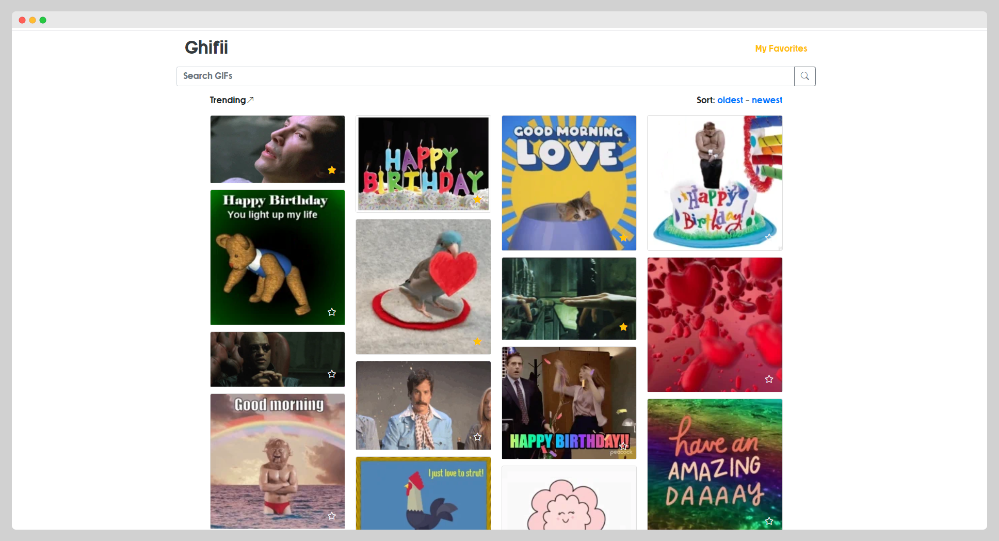

# GifApp
 This WebApp displays gifs from Giphy by using the [Giphy REST Api](https://developers.giphy.com/docs/api#quick-start-guide) . This WebApp let's you explore, search and mark as favorite the gifs that you like. It is available at https://smghifii.web.app
 
# Dependencies
This app requires bootstrap 4.x and bootstrap-icon 1.5.0 for a better looking and responsive UI.

# Project Structure
The WebApp is divided among six components apart for the app component which is the main component of the app and where the other components are nested:

- The Header component allows you to navigate through the Webapp and it's where you can search for other gifs with your query
- The Gifs Container component which displays the trending gifs that are automatically loaded upon reaching the bottom of the screen 
- The Search List component which displays the gifs based on the search query
- The Favorite Container component which display the gifs that you marked as your favourite
- The Gif Card component which displays a preview of the gif inside a card
- The Gif Detail component which displays a detailed view of the gif selected for examples it also display the title, the source and the date when the gif was uploaded

# Instructions
 1. You build this project by running 'ng build'. Make sure to run 'npm i' before running this project.
 2. For a local run use 'ng serve' and navigate to http://localhost:4200/. 

# Images

# Try it out!

[Click this link to try the app!](https://smghifii.web.app/)
